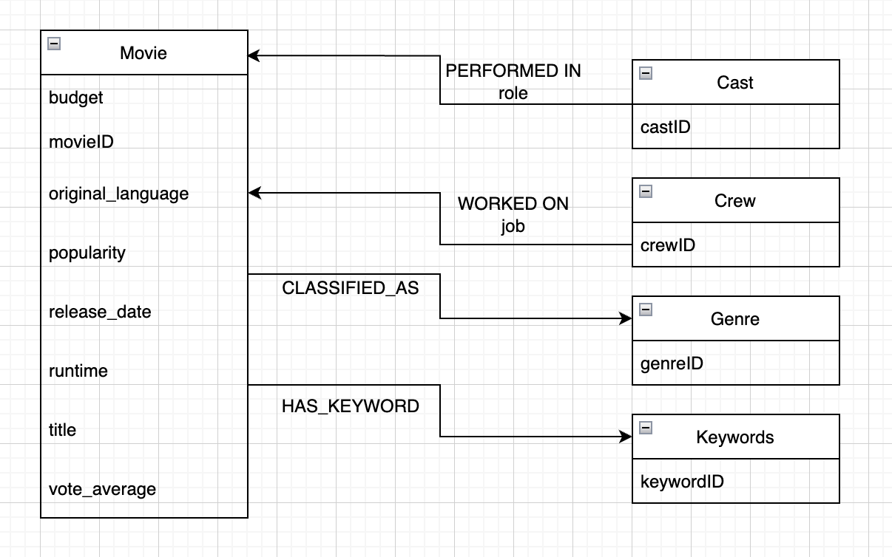
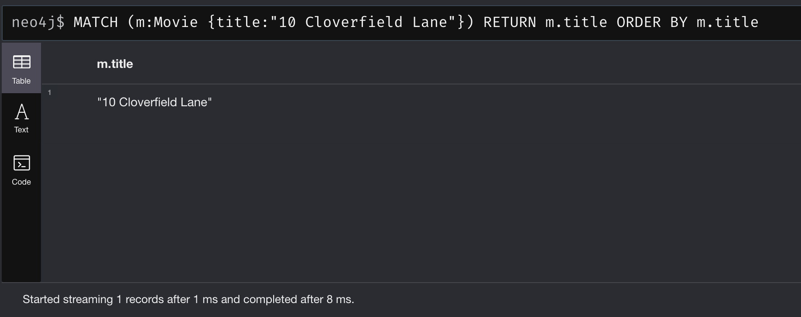
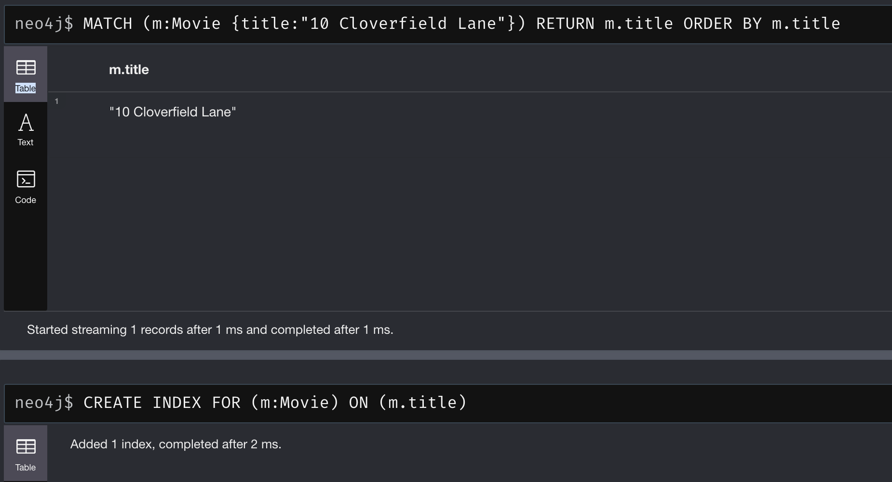

# Schema

<center></img></center>

# Populating the Database

## This process assumes you have already gotten a fresh neo4j database running on your machine

1. Run loader.py
2. run:

```
NEO4J_CONF=<PATH TO CONF> neo4j-admin import --database=neo4j --delimiter="|" --nodes=Movie=<PATH TO movies.csv> --nodes=Genre=<PATH TO genres.csv> --nodes=Cast=<PATH TO cast.csv> --nodes=Crew=<PATH TO crew.csv> —nodes=Keywords=<PATH TO keywords.csv> --relationships=<PATH TO genre_relations.csv> --relationships=<PATH TO cast_relations.csv> --relationships=<PATH TO keyword_relations.csv> --relationships=<PATH TO crew_relations.csv>
```

3. start your, now populated, neo4j server with this command:

```
NEO4J_CONF=<PATH TO CONF> neo4j console
```

# To Run DAL Programs

1. cd into the python folder and run the command:

```
python3 -m venv env
```

2. run:

```
source env/bin/activate
```

and

```
pip3 install neo4j
```

# Creating an Index

Creates a Binary Tree index for all movie titles.

```
CREATE INDEX FOR (m:Movie) ON (m.title)
```

Run the following snippet to see the index that has been added.

```
:schema
```

Run the following snippet to drop the newly created index (if you wanna test it yourself)

```
DROP INDEX index_ea29e173
```

# Evidence of Impact for Indexing

### Before Creating Index on Movie Titles

> Pay close attention to the timings at the bottom of the returned table (8ms)

<center></img></center>

### After Creating Index on Movie Titles

> Pay close attention to the timings at the bottom of the returned table (1ms)

<center></img></center>

<br>

## Table of Pre/Post Index Performance (10 Runs)

| Before Index | After Index |
| ------------ | ----------- |
| 32 ms        | 3 ms        |
| 8ms          | >1 ms       |
| 7ms          | >1 ms       |
| 6ms          | 1 ms        |
| 6ms          | 1 ms        |
| 9ms          | >1 ms       |
| 9ms          | >1 ms       |
| 8ms          | >1 ms       |
| 8ms          | 1 ms        |
| 8ms          | 1 ms        |
